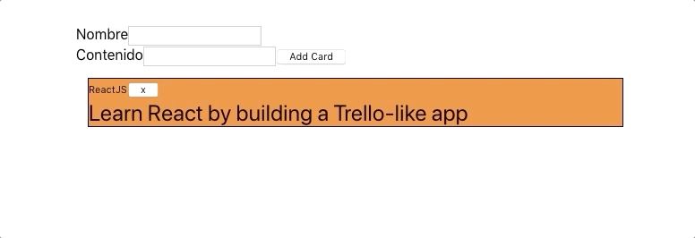

# My To-do list

A Trello clone using React!

## Available Scripts

In the project directory, just run:
    
    json-server -p 3001 --watch src/utils/mocks/FILE_NAME.json
    yarn start (react-scripts start)
    
, and open [http://localhost:3000](http://localhost:3000) to view the app in your browser.
    
Additional commands:

    yarn build (react-scripts build)
    yarn test (react-scripts test)
    yarn eject (react-scripts eject)

## Notes

* **This is still in development!**
* To make it work in development, I used [json-server](https://github.com/typicode/json-server)
* The installation instructions shown on the link above didn't work for me. I had to install json-server using the _global_ option!
        
        yarn global add json-server

* On the _Available Scripts_ section says that there needs to exist the following file: _src/utils/mocks/FILE_NAME.json_. This file has to have the format shown bellow:

        {
          "payload": [
            {
              "id": "1",
              "task_description": "First task of the list",
              "task_name": "Hello Wolrd!"
            }
          ]
        }

## References

How did I create the app?

    npx create-react-app to-do-list